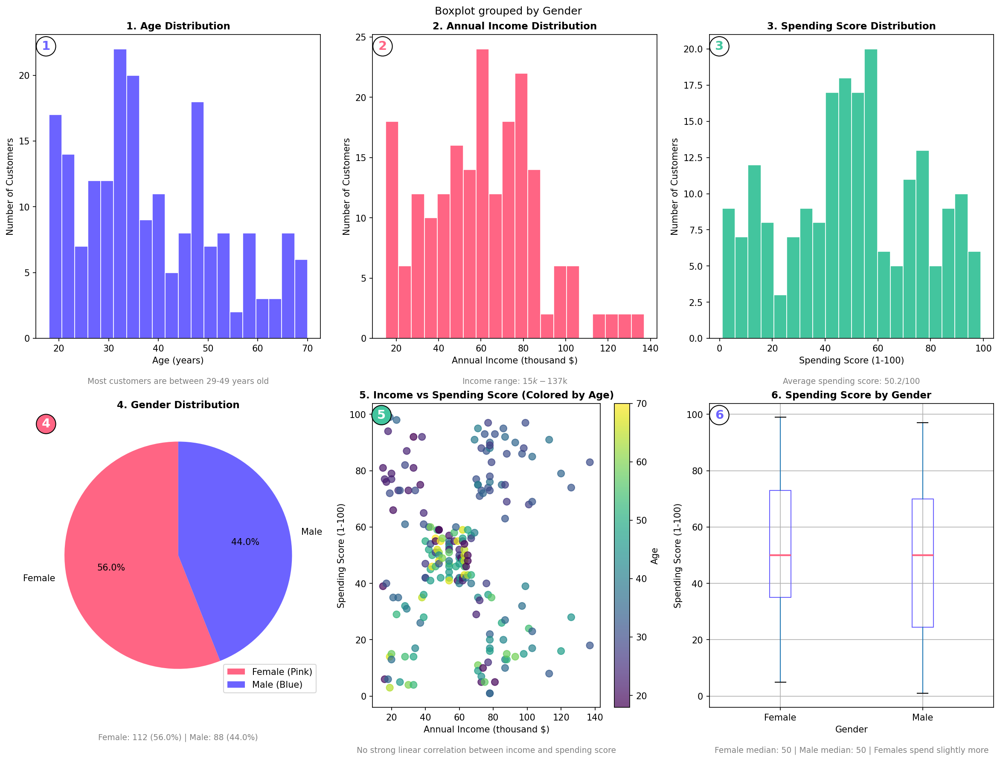
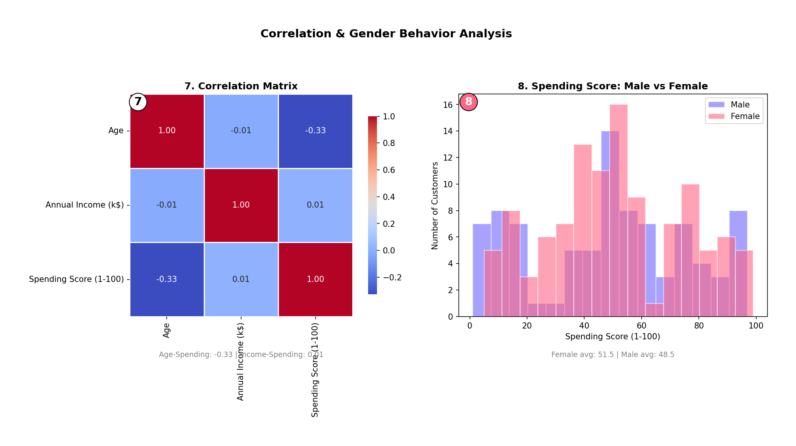
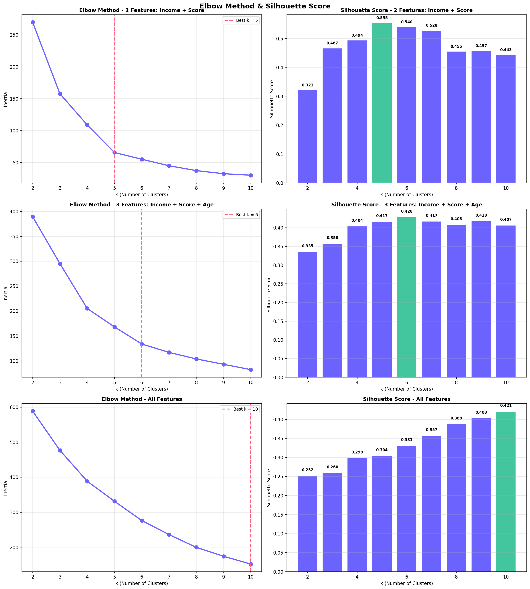
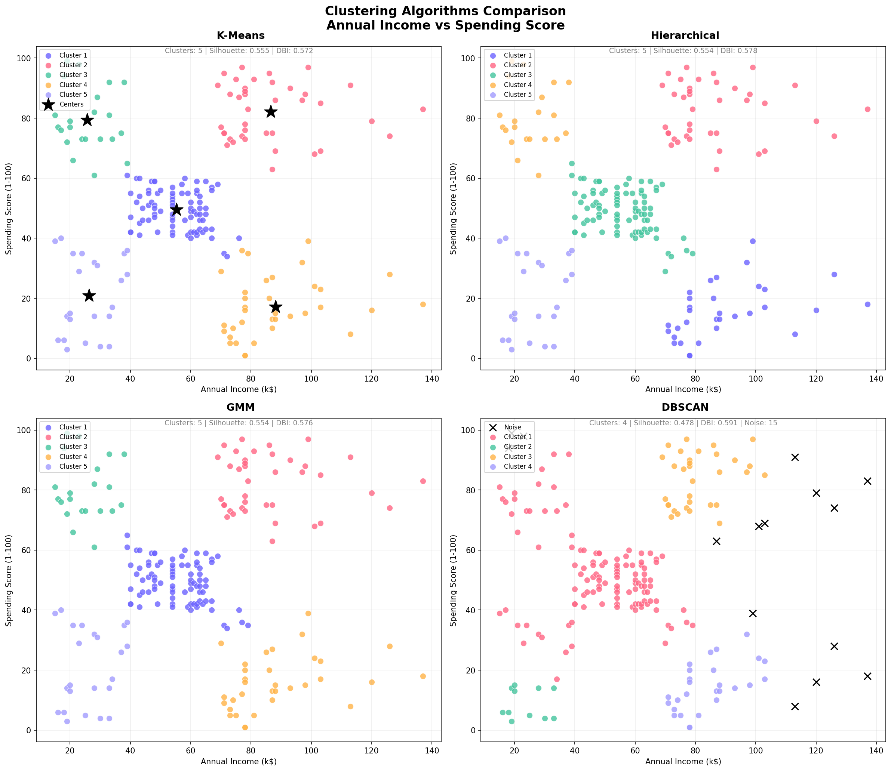
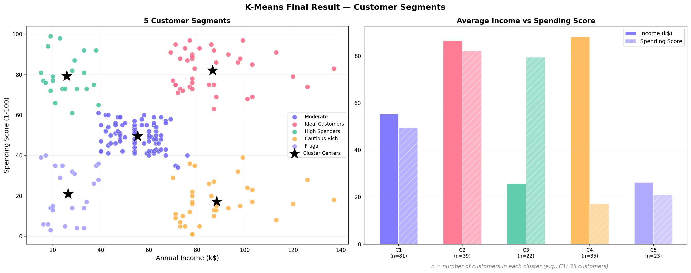

# Customer Segmentation using Clustering

## Project Overview

This project applies unsupervised machine learning techniques to segment customers based on demographic characteristics and spending behavior.

The objective is to identify meaningful customer groups that can support marketing strategies, customer retention efforts, and personalized business decisions.

Multiple clustering algorithms were evaluated and compared to determine the most effective segmentation approach.

---

## Business Problem

Businesses often serve customers with different purchasing habits and spending patterns.

Treating all customers the same can lead to ineffective marketing campaigns, lower engagement, and missed business opportunities.

Customer segmentation helps businesses:

* Identify high-value customers
* Improve customer retention
* Personalize promotions and offers
* Design targeted marketing campaigns
* Better understand customer behavior

---

## Dataset

The dataset contains customer information including:

* Customer ID
* Gender
* Age
* Annual Income (k$)
* Spending Score (1–100)

### Dataset Summary

* 200 customers
* 5 features
* No missing values
* No duplicate records

---

## Exploratory Data Analysis (EDA)

Exploratory analysis was performed to understand:

* Customer demographics
* Age distribution
* Income distribution
* Spending behavior
* Relationships between variables
* Potential outliers

Several visualizations were used to identify patterns and support clustering decisions.

### EDA Visualizations





---

## Data Preprocessing

The following preprocessing steps were applied:

* Missing value inspection
* Duplicate value inspection
* Gender encoding
* Feature scaling using StandardScaler

These steps ensure fair comparison across clustering algorithms.

---

## Outlier Analysis

Outliers were identified using the IQR (Interquartile Range) method.

Since the objective of this project is customer segmentation, extreme observations may represent meaningful customer groups rather than data errors.

Therefore, outliers were retained for clustering analysis.

---

## Clustering Approach

Different feature combinations were explored to evaluate their impact on customer segmentation.

The final clustering configuration was selected based on:

* Cluster interpretability
* Silhouette Score
* Davies-Bouldin Index
* Business relevance of customer segments

This approach ensured that the final clusters were both statistically meaningful and practically useful.

---

## Clustering Algorithms

The following clustering algorithms were evaluated and compared:

* K-Means
* Agglomerative Clustering
* DBSCAN
* Gaussian Mixture Model (GMM)

Each algorithm was assessed using quantitative metrics and visual cluster inspection.

---

## Model Evaluation

### Elbow Method & Silhouette Analysis

The optimal number of clusters was determined using:

* Elbow Method
* Silhouette Analysis



### Clustering Comparison

Multiple clustering algorithms were compared to identify the most interpretable customer segmentation strategy.



### Evaluation Metrics

The clustering models were evaluated using:

#### Silhouette Score

Measures how similar a customer is to its own cluster compared to other clusters.

Higher values indicate better cluster separation.

#### Davies-Bouldin Index

Measures cluster compactness and separation.

Lower values indicate better clustering performance.

---

## Results

After evaluating multiple clustering approaches, **K-Means** produced the most interpretable and business-friendly customer segments.

The final model successfully separated customers into distinct groups based on income and spending behavior.

### Final Customer Segments



---

## Customer Segments

The clustering analysis identified five meaningful customer groups:

### Ideal Customers

Customers with high income and high spending behavior.

**Recommended Actions**

* VIP programs
* Premium products
* Exclusive offers
* Loyalty campaigns

---

### High Spenders

Customers who actively spend and engage with products and services.

**Recommended Actions**

* Personalized promotions
* Reward programs
* Upselling opportunities

---

### Cautious Rich

Customers with high purchasing power but relatively low spending behavior.

**Recommended Actions**

* Re-engagement campaigns
* Personalized recommendations
* Targeted marketing efforts

---

### Frugal Customers

Price-sensitive customers with lower spending behavior.

**Recommended Actions**

* Discount campaigns
* Seasonal promotions
* Budget-friendly offers

---

### Moderate Customers

Customers with balanced income and spending characteristics.

**Recommended Actions**

* General marketing campaigns
* Cross-selling opportunities
* Retention strategies

---

## Business Impact

The identified customer segments can support business decision-making by enabling more targeted and effective marketing strategies.

Potential business benefits include:

* Improved customer retention
* Better allocation of marketing budgets
* Increased customer lifetime value
* Personalized customer experiences
* More effective promotional campaigns

Customer segmentation allows businesses to treat different customer groups according to their behavior and purchasing patterns rather than applying a one-size-fits-all strategy.

---

## Project Storytelling

A retail company wants to better understand its customer base and improve marketing effectiveness.

Using customer demographics and spending behavior, multiple clustering techniques were applied to identify meaningful customer groups.

Several clustering algorithms were evaluated and compared using quantitative metrics and business interpretability.

K-Means produced the most actionable customer segments, enabling the business to develop targeted marketing strategies for different customer groups.

---

## Technologies Used

* Python
* Pandas
* NumPy
* Matplotlib
* Seaborn
* Plotly
* Scikit-Learn
* SciPy

---

## Project Structure

```text
customer-segmentation-clustering/

├── data/
│   └── customer.csv

├── notebooks/
│   └── customer_segmentation.ipynb

├── reports/
│   └── figures/
│       ├── clustering_comparison.png
│       ├── dendrogram.png
│       ├── eda_plots.png
│       ├── eda_plots2.png
│       ├── elbow_silhouette.png
│       └── kmeans_final.png

├── README.md
├── requirements.txt
└── .gitignore
```

---

## How to Run

Clone the repository:

```bash
git clone <repository-url>
```

Install dependencies:

```bash
pip install -r requirements.txt
```

Open the notebook:

```text
notebooks/customer_segmentation.ipynb
```

Run all notebook cells to reproduce the analysis and clustering results.

---

## Future Improvements

Potential future enhancements include:

* Cluster stability analysis
* Automated cluster profiling
* Interactive Streamlit dashboard
* Real-world customer datasets
* Advanced segmentation strategies

---

## Conclusion

This project demonstrated how clustering techniques can be used to discover meaningful customer segments from behavioral and demographic data.

By comparing multiple clustering algorithms and evaluating both statistical performance and business relevance, the project identified actionable customer groups that can support marketing and customer retention strategies.

The results highlight the value of unsupervised learning in customer analytics and business decision-making.

---

## Author

**Farid Faridzmn**

Machine Learning & Data Science Portfolio Project
